## Introduction

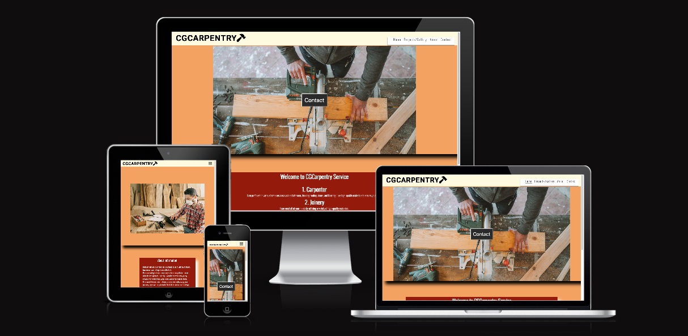

CGCarpentry is a website for a small carpentry business in Dublin and Leitrim. I'm creating a business for the first time and want to showcase my services on my website.

This website was created as the first project for Code Institute's Full Stack Software Development course. It was built using HTML and CSS. I used Gitpod to write the code.

## UX

* ## User stories:

#### New User:

* As a first-time user, I would like to find information about learning carpentry on the site.

* As a first-time user, I would like to be able to contact the website and provide feedback for carpentry.

* As a first-time user, I would like to see pictures of carpentry projects.

* As a first-time user, I would like to see their social media links to assess their interest in carpentry.

#### Returning User:

* As a returning user, I would appreciate it if there were some new photos added to the website. 

* As a returning user, I would like to check if there are any new downloads available. 

## Desgin

#### Color Scheme:

I used color from Cooler's website. Sandy brown color is suitable for wood.

| Color             | Hex                                                                |
| ----------------- | ------------------------------------------------------------------ |
| Sandy Brown   |  #f4a261  |
| Cornsilk      |  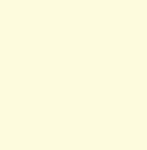 #fefae0 |
| Deep Red      |   #941b0c|
| Black         |   #000000   |
| White         |   #fff         |
| Dark Charcoal |   #2a2a2a |

#### Typogradhy:

* I used Oswald and Heebo from Google Fonts as the main font on the website, with 'Sans Serif'.

#### Imagery:

* I have taken some images from https://www.pexels.com/, and I have also taken a picture of myself.

## Features

#### Navigation:

* The four pages have a navigation bar with options for Home, Projects/Gallery, About, and Contact.

* "The site logo is clickable and it takes to the homepage of the website.

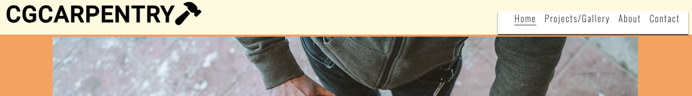

#### Landing Pagae:

* The hero image is used to present carpentry. 

* Click on the contact button located on the hero image. This will redirect to the contact page of the website.

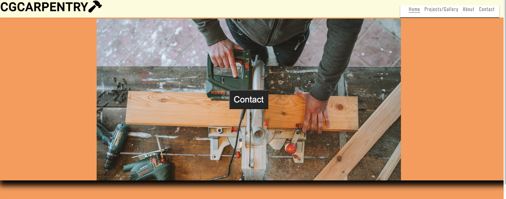

#### Footer:

* This section includes links that click to access social media Facebook, Instagram, Youtube, and WhatsApp sites.

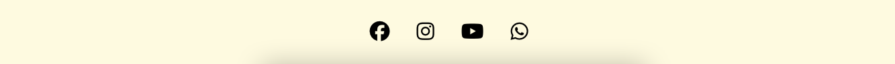

## Wirefrom

#### Desktop:
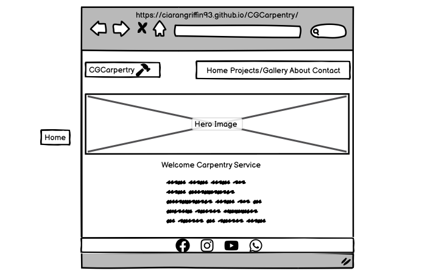

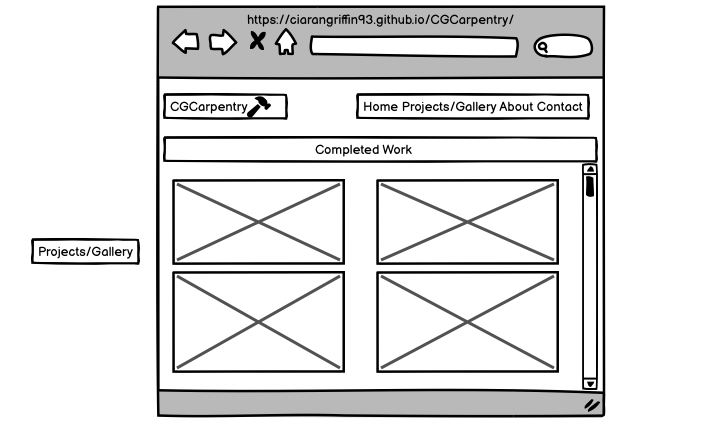

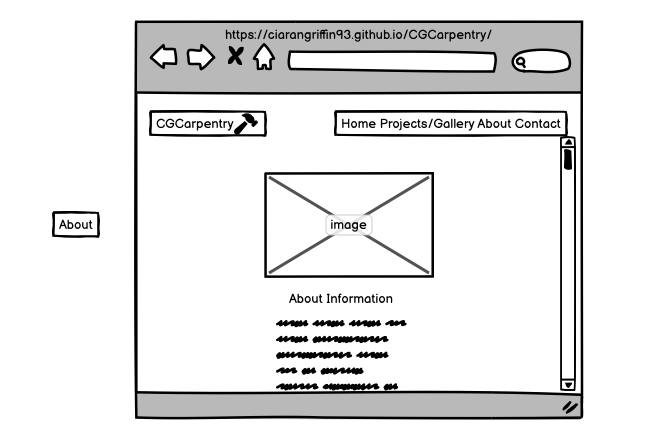

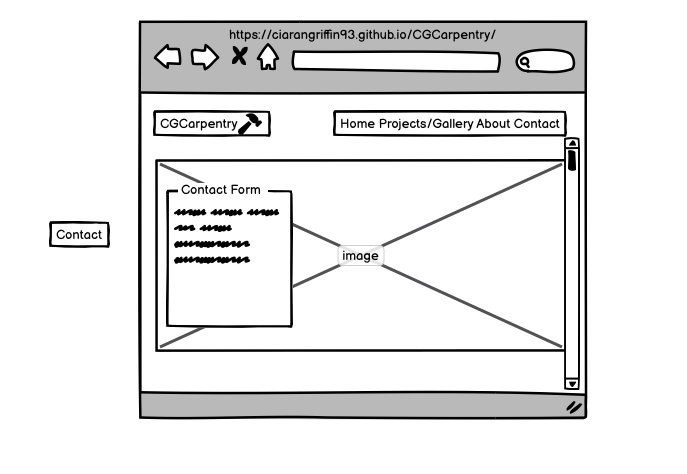

#### Ipad:
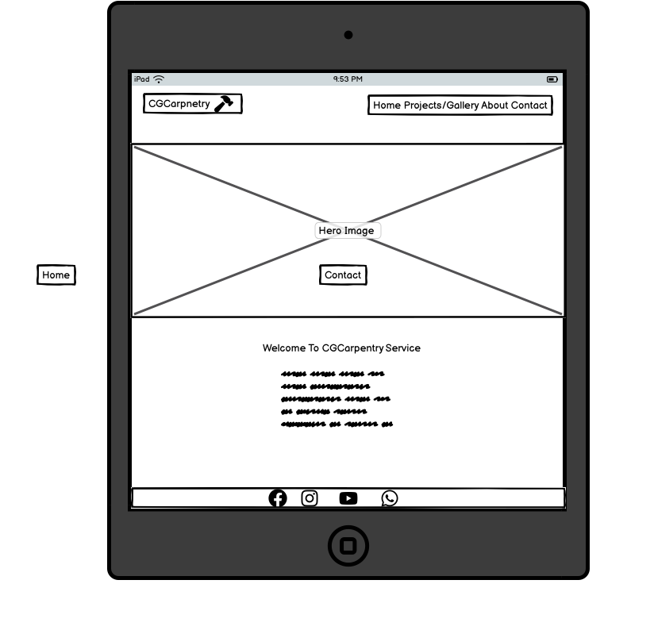

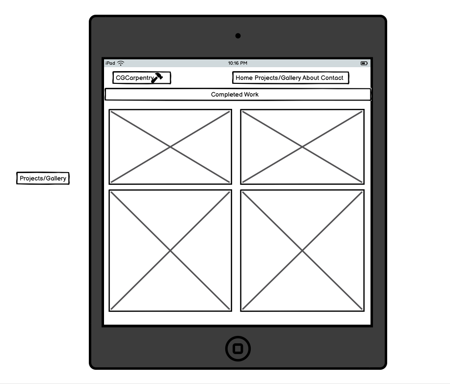

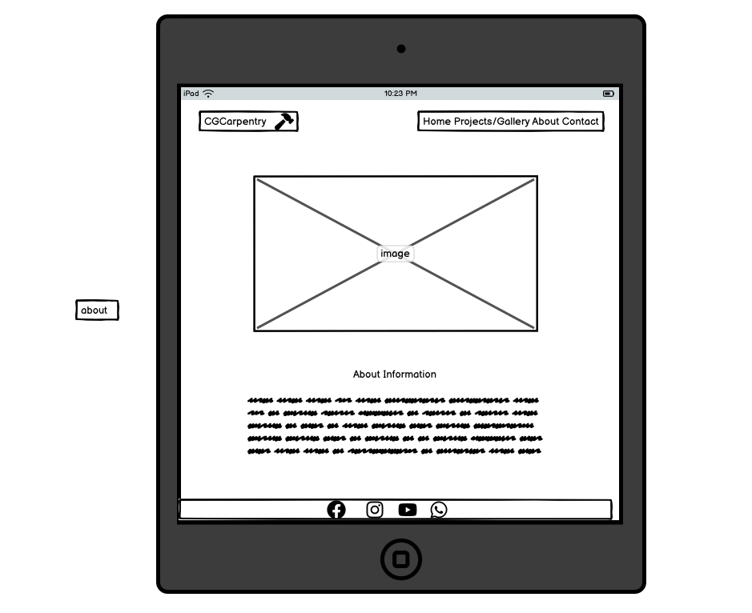

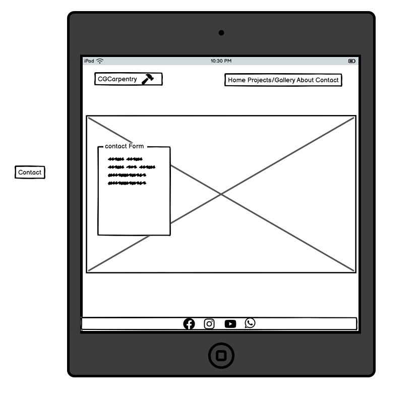

#### Mobile:

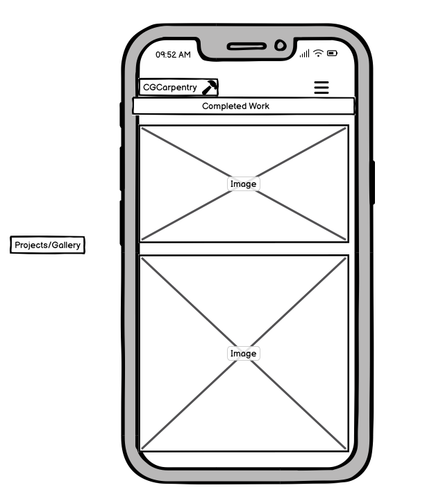

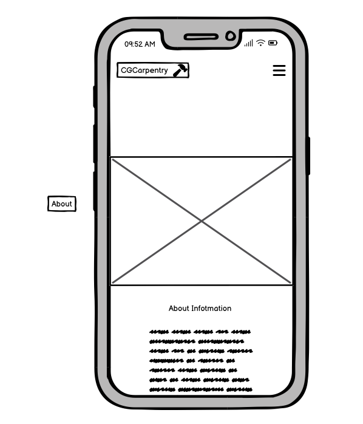

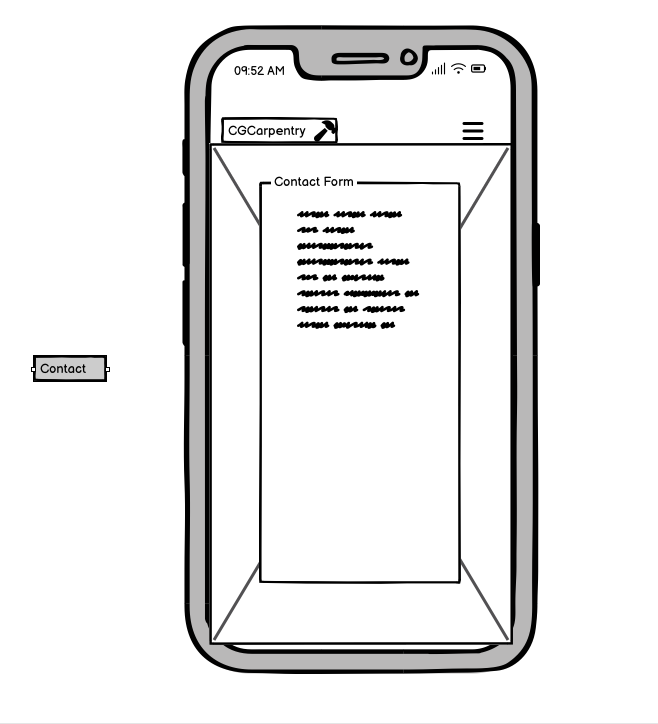

## Validator Testing:

* The process of checking the HTML document has been completed and there are no errors or warnings to display.

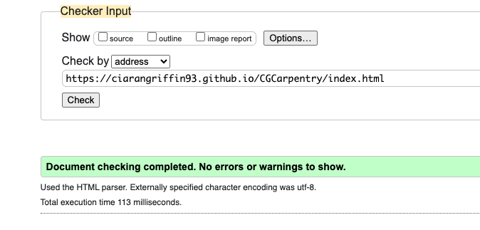
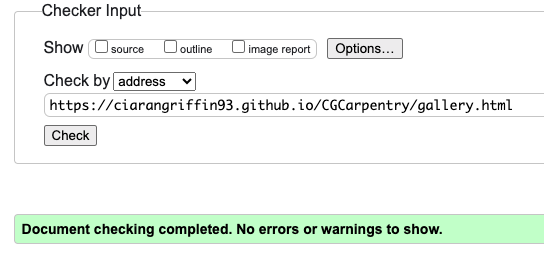
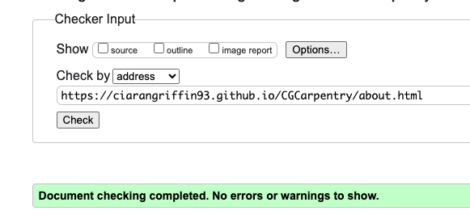
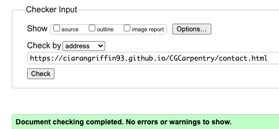

* The CSS document has been checked and I am happy to report that there are no errors or warnings to display.

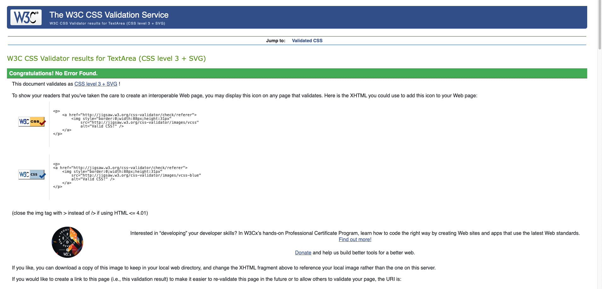 

## Lighthouse Testing:

* The SpeedPage Lights report showed good results for the site.

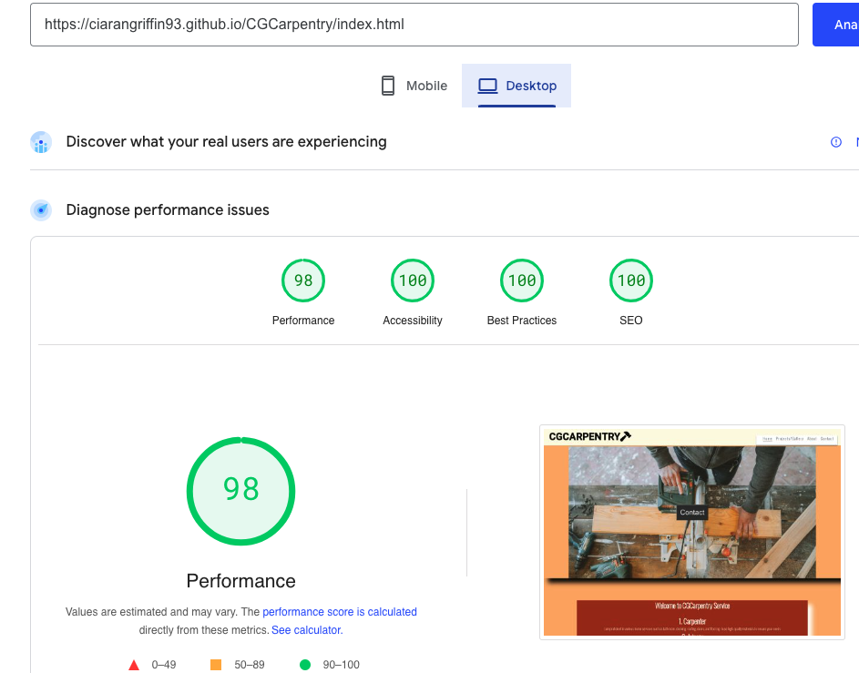
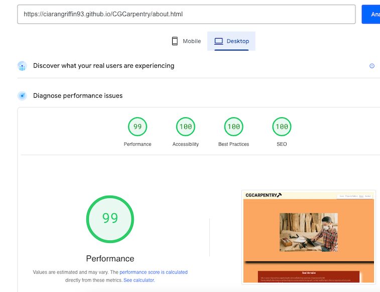 
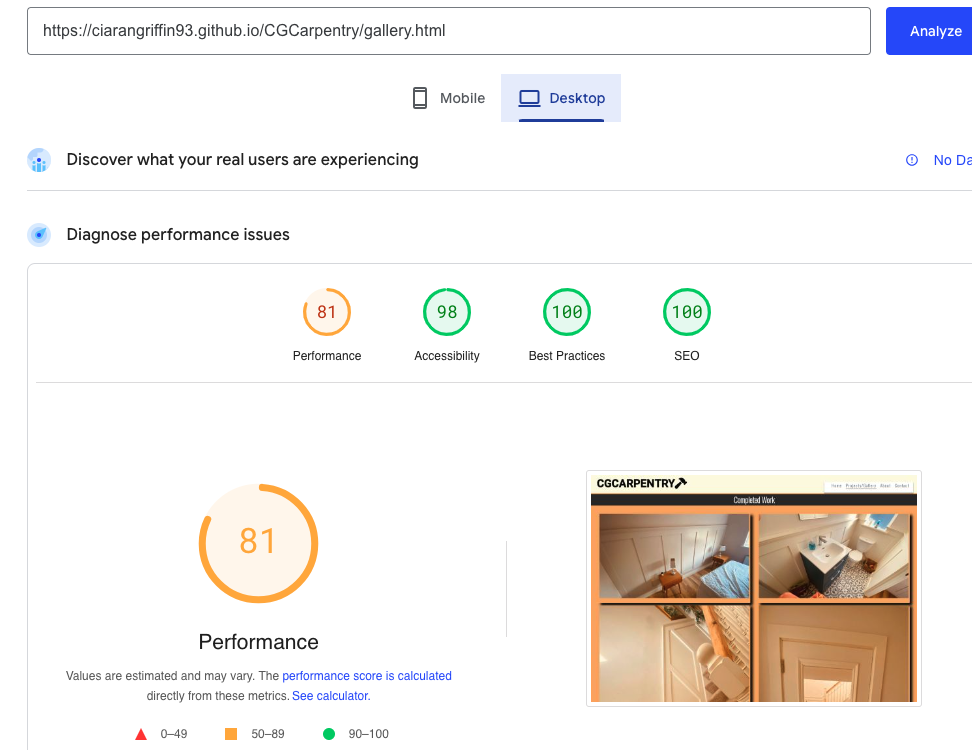
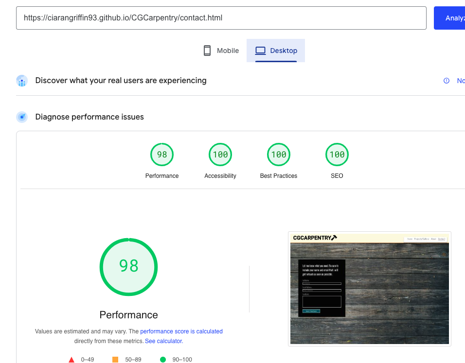

## Technologies:

* HTML: Structure a web and use it for content.

* CSS: CSS is a programming language used to style and format the layout of websites.

* Font Awesome: was used for logo and the social media icons in the footer. The icon was at https://fontawesome.com/.

* Favicon: A favicon is a small icon that appears on the web browser tab of a website. Favicon was at https://www.hoststar.at/en/content/website-favicon-generator.

* Gitpod: Gitppd is a platform that simplifies the process of creating demos for site. 

* Git: used write Git to commit and push the code for the development of the website.

* Github: deploy the site.

## Acknowledgements:

* I would like to thank to my mentor, Tim Nelson, for his help and unwavering support.

* I would like to thank to my tutor at Code Institute for their help and unwavering support.

[def]: https://ciarangriffin93.github.io/CGCarpentry/