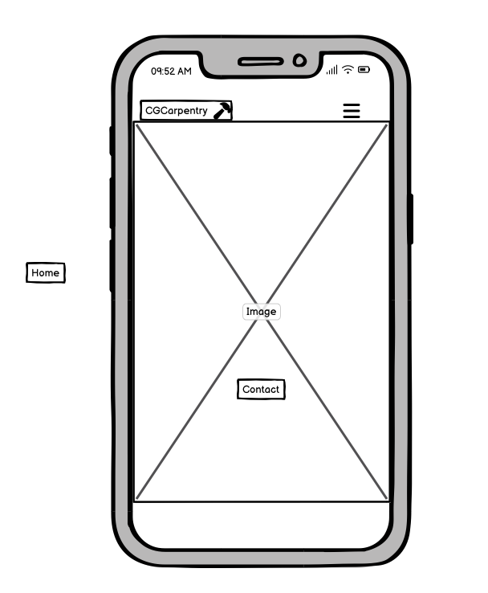

# [CGCarpentry](https://ciarangriffin93.github.io/CGCarpentry/)

## Introduction

CGCarpentry is a website for a small carpentry business in Dublin and Leitrim. I'm creating a business for the first time and want to showcase my services on my website.

This website was created as the first project for Code Institute's Full Stack Software Development course. It was built using HTML and CSS. I used Gitpod to write the code.

## UX

## User stories:

#### New User:

* As a first-time user, I would like to find information about learning carpentry on the site.

* As a first-time user, I would like to be able to contact the website and provide feedback for carpentry.

* As a first-time user, I would like to see pictures of carpentry projects.

* As a first-time user, I would like to see their social media links to assess their interest in carpentry.

#### Returning User:

* As a returning user, I would appreciate it if there were some new photos added to the website. 

* As a returning user, I would like to check if there are any new downloads available. 

## Desgin

#### Color Scheme:

I used color from Cooler's website. Sandy brown color is suitable for wood.

| Color             | Hex                                                                |
| ----------------- | ------------------------------------------------------------------ |
| Sandy Brown   |  #f4a261  |
| Cornsilk      |   #fefae0 |
| Deep Red      |   #941b0c|
| Black         |   #000000   |
| White         |   #fff         |
| Dark Charcoal |   #2a2a2a |

#### Typogradhy:

* I used Oswald and Heebo from Google Fonts as the main font on the website, with 'Sans Serif'.

#### Imagery:

* I have taken some images from https://www.pexels.com/, and I have also taken a picture of myself.

## Features

#### Navigation:

* The four pages have a navigation bar with options for Home, Projects/Gallery, About, and Contact.

* "The site logo is clickable and it takes to the homepage of the website.

#### Landing Pagae:

* The hero image is used to present carpentry. 

* Click on the contact button located on the hero image. This will redirect to the contact page of the website.

#### Footer:

* This section includes links that click to access social media Facebook, Instagram, Youtube, and WhatsApp sites.

#### Gallery page:

* Several images are shown of project carpentry.

#### Contact Page:

* A user can input their first name, last name, email address, and select events of interest via a form.

## Wirefrom

#### Desktop:

#### Ipad:

#### Mobile:

## Validator Testing:

* The process of checking the HTML document has been completed and there are no errors or warnings to display.

* The CSS document has been checked and I am happy to report that there are no errors or warnings to display.

 

## Lighthouse Testing:

* The SpeedPage Lights report showed good results for the site.

 

## Unfixed Bugs:

No bugs left unfixed

## Deployment:

The site was deployed to GitHub Pages. The steps to deploy are as follows:

- In the [GitHub repository](https://github.com/RaymondBrien/taskbloomer), navigate to the Settings tab 
- From the source section drop-down menu, select the **Main** Branch, then click "Save".
- The page will be automatically refreshed with a detailed ribbon display to indicate the successful deployment.

The live link can be found [here](https://raymondbrien.github.io/taskbloomer)

### Local Deployment

This project can be cloned or forked in order to make a local copy on your own system.

#### Cloning

You can clone the repository by following these steps:

1. Go to the [GitHub repository](https://github.com/RaymondBrien/taskbloomer) 
2. Locate the Code button above the list of files and click it 
3. Select if you prefer to clone using HTTPS, SSH, or GitHub CLI and click the copy button to copy the URL to your clipboard
4. Open Git Bash or Terminal
5. Change the current working directory to the one where you want the cloned directory
6. In your IDE Terminal, type the following command to clone my repository:
	- `git clone https://ciarangriffin93.github.io/CGCarpentry/`

Please note that in order to directly open the project in Gitpod, you need to have the browser extension installed.
A tutorial on how to do that can be found [here](https://www.gitpod.io/docs/configure/user-settings/browser-extension).

#### Forking

By forking the GitHub Repository, we make a copy of the original repository on our GitHub account to view and/or make changes without affecting the original owner's repository.
You can fork this repository by using the following steps:

1. Log in to GitHub and locate the [GitHub Repository](https://github.com/RaymondBrien/taskbloomer)
2. At the top of the Repository (not top of page) just above the "Settings" Button on the menu, locate the "Fork" Button.
3. Once clicked, you should now have a copy of the original repository in your own GitHub account!

## Credit:

#### Media
* [Pexels](https://www.pexels.com/): The website uses images sourced from Pexels.
https://www.pexels.com/photo/man-using-a-laptop-at-a-wood-workshop-4491881/

https://www.pexels.com/photo/a-man-cutting-wood-using-an-electric-jigsaw-6232447/

* Wireframes for all Wireframes.

#### Content
* [W3schools](https://www.w3schools.com/)This site was created using information from Code Institute and W3Schools.

* This website has helped me to gain a better understanding of the display function.

* [Font Google](https://fonts.google.com/)I added a font to my project using Google Fonts.

* [Font Awesome](https://fontawesome.com/)I have added Font Awesome to the project.

## Technologies:

* [HTML](https://en.wikipedia.org/wiki/HTML): Structure a web and use it for content.

* [CSS](https://en.wikipedia.org/wiki/CSS): CSS used for the main site design and layout.

* [Font Awesome](https://fontawesome.com/): was used for logo and the social media icons in the footer.

* [Favicon](https://www.hoststar.at/en/content/website-favicon-generator): A favicon is a small icon that appears on the web browser tab of a website.

* [Gitpod](https://gitpod.io): Cloud IDE was used to write, commit, and push code to GitHub

* [Git](https://git-scm.com): used write Git to commit and push the code for the development of the website.

* [Github](https://github.com): deploy the site.

* [Github Page](https://pages.github.com): The front-end site has been deployed using GitHub Pages for hosting.

## Acknowledgements:

* I would like to thank to my mentor, Tim Nelson, for his help and unwavering support.

* I would like to thank to my tutor at Code Institute for their help and unwavering support.

* I would like to Code Institute's Slack community and Deaf group for their support.

